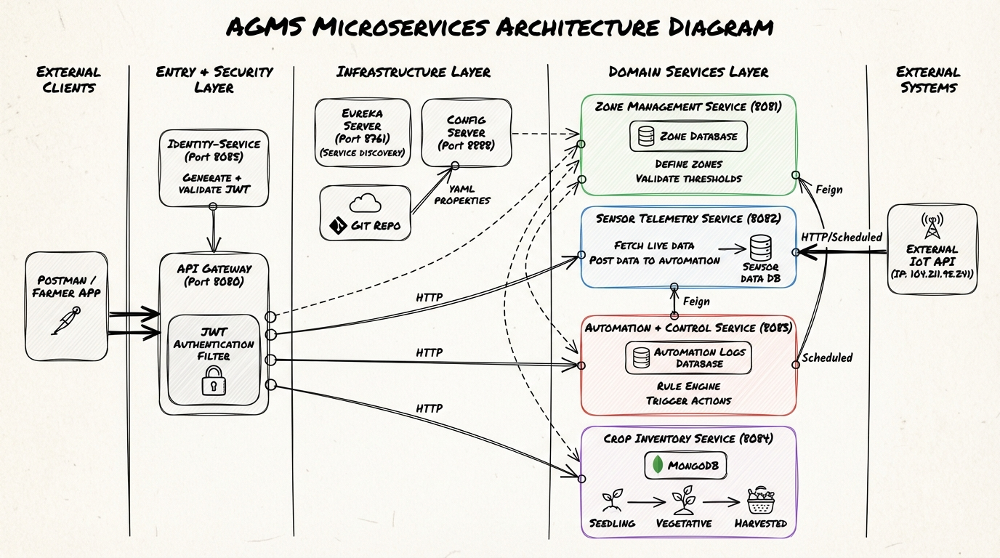
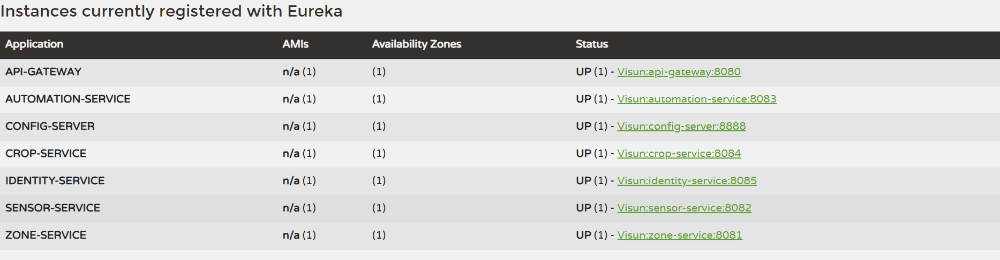

# AGMS - Automated Greenhouse Management System 🌿💻

The Automated Greenhouse Management System (AGMS) is a cloud-native, microservice-based platform designed to monitor and manage greenhouse environments using live IoT telemetry. This system allows farmers to define zones, set environmental thresholds, and automate climate control actions (like turning on fans or heaters) in real-time.

## 🏗️ System Architecture

Below is the high-level architecture diagram of the system, showcasing the communication flow between infrastructure and domain services.

---

## 🛠️ Tech Stack
- **Framework:** Spring Boot, Spring Cloud
- **Service Discovery:** Netflix Eureka
- **API Gateway:** Spring Cloud Gateway (with JWT Security)
- **Configuration:** Spring Cloud Config
- **Communication:** OpenFeign (Synchronous)
- **Database:** MongoDB (Polyglot Persistence)
- **External Integration:** Live IoT Data Provider API

---

## 🚀 Getting Started

To ensure the system starts correctly, you **MUST** follow the specific startup order below. Infrastructure services must be fully operational before domain services are launched.

### 1️⃣ Infrastructure Services (Start First)

1.  **Eureka Server (Service Registry)**
    - Port: `8761`
    - Start this first so other services can register.
2.  **Config Server (Centralized Configuration)**
    - Port: `8888`
    - Ensure your Git repository with YAML properties is accessible.
3.  **API Gateway (Single Entry Point)**
    - Port: `8080`
    - Handles routing and JWT authorization.

### 2️⃣ Domain Services (Start Second)

Once the infrastructure is UP, start the following services:
- **Identity Service** (Port: `8085`) - For Authentication & JWT generation.
- **Zone Management Service** (Port: `8081`)
- **Sensor Telemetry Service** (Port: `8082`)
- **Automation & Control Service** (Port: `8083`)
- **Crop Inventory Service** (Port: `8084`)

---

## 📊 Eureka Dashboard

Once all services are started, you can verify their status on the Eureka Dashboard. All services should be marked as **UP**.

---

## 🔐 Authentication & API Access

All requests to the domain services (except `/auth/**`) require a valid **JWT Bearer Token**.
1.  **Register/Login** via `http://localhost:8080/auth/register` or `login`.
2.  Copy the `token` from the response.
3.  Add it to the `Authorization` header as `Bearer <token>` for all other API calls.

---

## 🧪 Testing with Postman

A complete Postman collection is included in the root directory:
- **File:** `AGMS-API-Collection.json`
- **How to use:** Import the JSON file into Postman and ensure your local environment is running.

---

## 📁 Project Structure
- `infrastructure-services/` - Eureka, Config, Gateway
- `domain-services/` - Zone, Sensor, Automation, Crop, Identity
- `docs/` - Architecture diagrams and dashboard screenshots
- `config-repo/` - Externalized YAML configuration files
